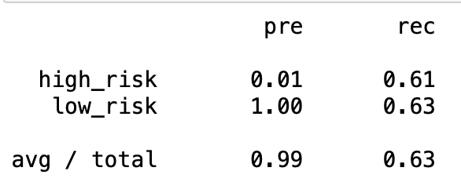
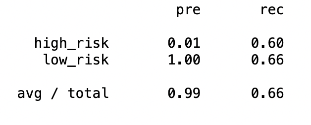
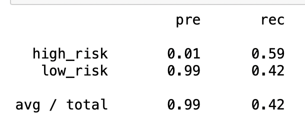
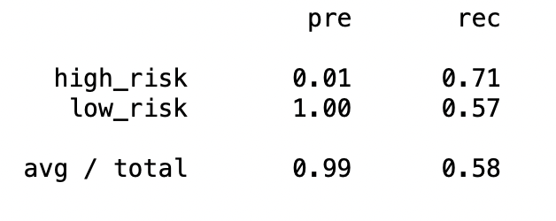
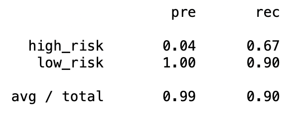
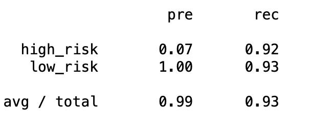

# Credit_Risk_Analysis

## __Overview:__

This analysis is mainly aimed at eliminating class imbalances when studying data related to credit card risk. The data is resampled using imbalanced-learn and scikit-learn libraries. Different techniques such as RandomOverSampler, SMOTE algorithms and ClusterCentroids algorithms are applied to oversample and undersample the data and to train and evaluate models with unbalanced classes.

## __Results:__

The results from the various machine learning models are listed below:

- ### Naive Random Oversampling:
    Balanced Accuracy score: 0.618

    Precision and recall scores:
    

- ### SMOTE Oversampling:
    Balanced Accuracy score: 0.628

    Precision and recall scores:
    
- ### Cluster Centroids Undersampling:
    Balanced Accuracy score: 0.505

    Precision and recall scores:
    

- ### SMOTEENN Under and over sampling:
    Balanced Accuracy score: 0.640

    Precision and recall scores:
    
- ### Balanced Random Forest Classifier:
    Balanced Accuracy score: 0.788

    Precision and recall scores:
     
- ### Easy Ensemble AdaBoost Classifier
    Balanced Accuracy score: 0.929

    Precision and recall scores:
    